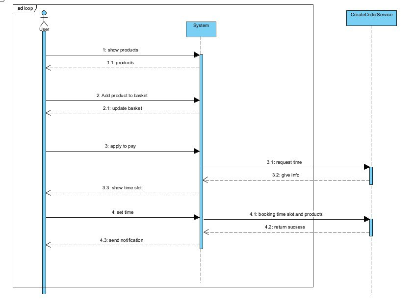
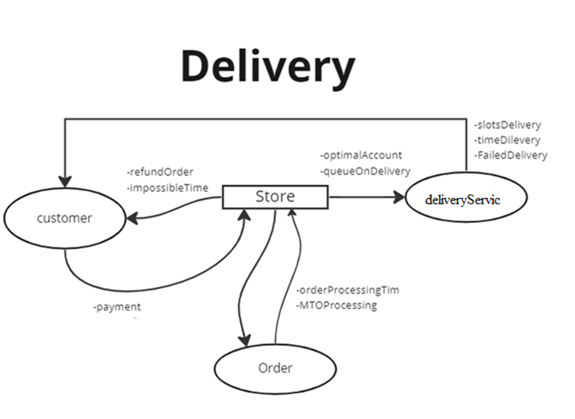
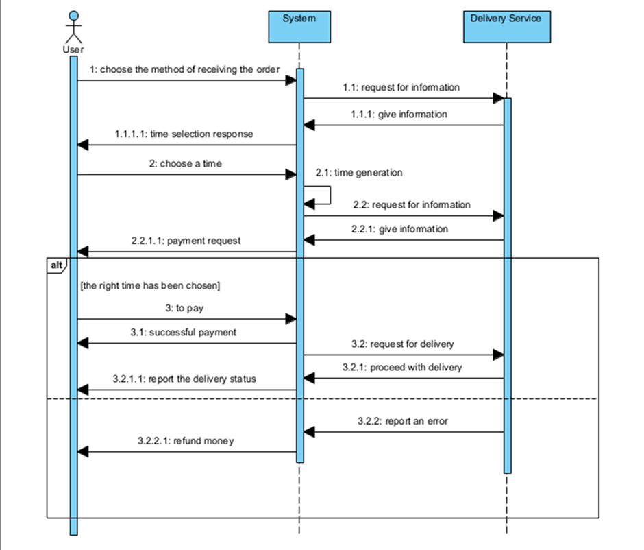
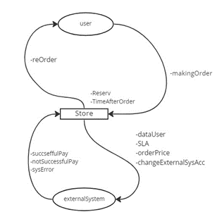
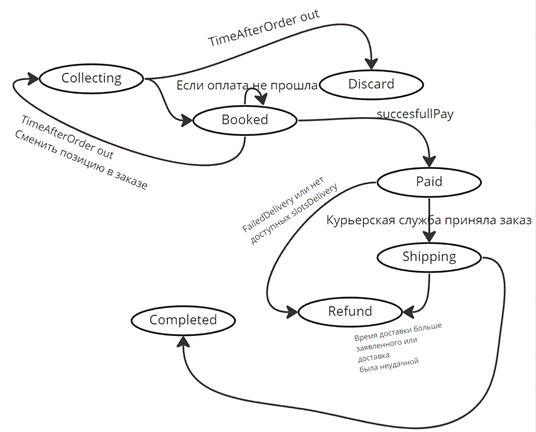
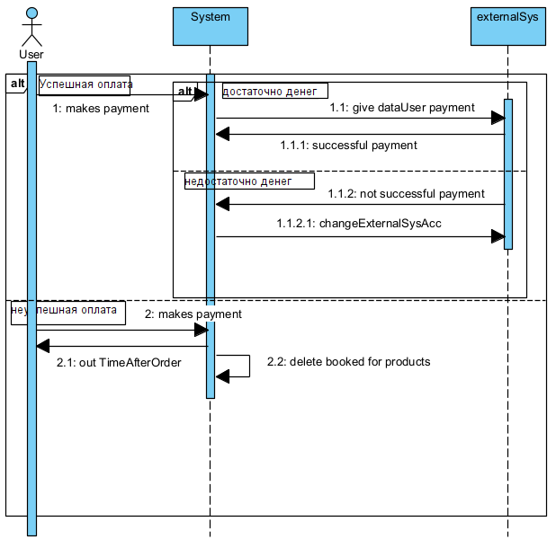

### [Описание системы](./descriptionSystem.md)

### Функциональные требования, пользователь может:
1.	Просматирвать каталог
2.	Добавить товар в заказ или несколько товаров
3.	Изменять список товаров в заказе
4.	Выбирать время доставки в заказе
5.	Произвести оплату после выбора параметров доставки
6.	Просматривать уведомление, о незавершенном заказе

### Нефункциональные требования:
1.	Надежность — сайт должен быть доступен для пользователей из России определенный процент времени в месяц.
2.	Производительность — загрузка страниц должна быть осуществлена за опредленное минимальное время.
3.	Масштабируемость — система должна поддерживать минимальное кол-во пользователей.
4.	Безопасность - доступ к базе данных только у администратора.
5.	Взаимодействие между модулями происходит через API.
6.	Обращение к внешней системе происходит по протоколу HTTP.
7.	Магазин выбирает оптимальный аккаунт, чтобы доставить заказ в выбранное время.
8.	Сохранение историй обращений к внешней системе, включающее результаты обращения, длительность и уникальный id операции, который генерирует внешняя система при обращении.
9.	 Существование метрики длительность процесса финализации.
10.	 Существование метрики qps к внешней системе: оповещения о “брошенной” корзине, количество успешных/неуспешных сабмитов, 
11.  Неуспешные запросы должны быть сгруппированы по кодам ответа
12.	 Существование метрики: среднее время, которое проходит от бронирования до оплаты заказа.

### Сбор заказа(корзины):

- User (Пользователь) - это человек использующий наш интернет-магазин
- Product (Товар) - это физический продукт, предназначенные для продажи пользователям для удовлетворения их потребностей
- Catalog (Каталог) - все товары в магазине
- Basket(корзина) - некая сущность, которая хранит в себе Basket position
- Basket position (Позиция корзины) - товар и его количество
- Creating basket (Создание корзины) - выбор товара и его количества с добавлением в заказ
- Order (заказ) - это такой объект, который содержит в себе Basket, User, Delivery time
- Making order (Оформление заказа) - этап формирования заказа, на котором пользователь подтверждает намерение оплатить его и бронирует время доставки 
- Delivery time (Время доставки) - период(слоты) времени за который пользователь должен получить заказ
Abandoned basket ("брошенные" корзины) - созданные заказы, которые пользователь не забронировал
- DISCARDED order (Отмененный заказ) - это такой заказ, который за некий промежуток времени не был подтвержден пользователем, к которому пользователь больше не имеет доступа

### Доставка:

- customer (покупатель) - человек который использует наш сервис.
- deliveryService (Служба доставки) - система отвечающая за доставку товаров.
- order (заказ) - это совокупность товаров, которая содержит сведения о них и состоянии заказа в целом. (Синоним к Order из словаря сбора заказов)
- timeDilevery (время доставки) - время, необходимое courierService необходимое для доставки заказа покупателю начиная с момента формирования заказа, и заканчивая его оплатой и доставкой.
- failedDelivery(Доставка невовремя) - доставка, которая по каким-то причинам выполнилась не в срок.
- slotsDelivery (Доступное время доставки) - магазин предоставляет возможные временные слоты доставки, благодаря которым пользователь должен выбрать желаемое время получения заказа.
- queueOnDelivery (очередь на доставку) - после оплаты, заказ встает в так называемую очередь на доставку.
- orderProcessingTime (время обработки заказа) - это время с момента размещения заказа до его отправки.
- MTOProcessing( MaxTimeOrder processing верхний порог времени для обработки одного заказа) - верхний порог времени для обработки одного заказа.
- optimalAccount (Оптимальный аккаунт) - аккаунт, который выбирает магазин чтобы доставить заказ за минимальное количество времени.
- impossibleTime (Невозможное время доставки) - невозможное время доставки из-за чего производится рефанд стоимости.
PAID → SHIPPING
●	Когда сабмит доставки во внешнюю систему произошел успешно (курьерская служба приняла заказ)
PAID → REFUND
●	Если заказ не был отправлен службе доставки (большая очередь, нет смысла ждать или служба доставки недоступна после проведения {какого-то количества} повторных попыток)
SHIPPING → REFUND
●	Если время доставки было больше заявленного или если доставка была неудачной.
SHIPPING → COMPLETED

### Оплата:

- user(синонимы: customer) (пользователь) - человек который использует наш сервис.
- externalSys (внешняя система) - внешняя система оплаты заказа.
- Reserv (бронирование товара) - система бронирует товар, когда пользователь оформляет заказ
- makingOrder (оформление заказа) - действие пользователя по завершению сбора корзины
- SLA (время от сабмита во внешнюю систему до появления информации об успешности или неуспешности оплаты)
- successfulPay (удачная оплата) - удачная оплата происходит в случае если пользователь удовлетворяет условиям системы (не было ошибки системы, достаточно денег, не прошло время после оформления заказа)
- notSuccessfulPay (не удачная оплата) - неудачная оплата происходит в случае если пользователь не удовлетворяет условиям системы (ошибка системы, недостаточно денег, прошло много времени после оформления заказа)
- externalSysAcc (аккаунт внешней системы) - конкретный аккаунт внешней системы оплаты
- TimeAfterOrder(Время после оформления заказа) - время которое дается пользователю для оплаты заказа после оформления
- reOrder(Повторное оформление заказа) - действие которое делает пользователь если на этапе оформления/оплаты заказа у него/системы произошла ошибка.
- dataUser(информация о пользователе) - информация которую передает пользователь системе(платежные данные, данные пользователя).
- orderPrice(сумма заказа) - сумма заказа в корзине пользователя
- sysError(Ошибка система) - ошибка, которая может произойти в системе на любом этапе работы.
- changeExternalSysAcc (Смена внешней системы) - действие которое делает система, если с текущей внешней системой произошла ошибка. Система меняет внешнюю на другую.
- orderStatus (состояние заказа) - информация о том, какой статус имеет наш заказ
- Collecting - сбор
- Booked - забронирован
- Discard - отказаться
- Paid - оплаченный
- Shipping - перевозка
- Refund - возврат
- Completed – завершенный

